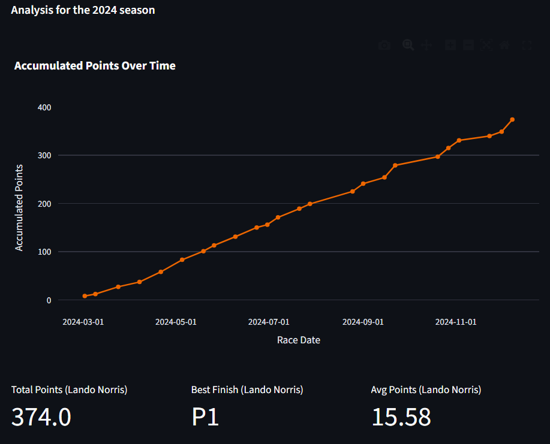
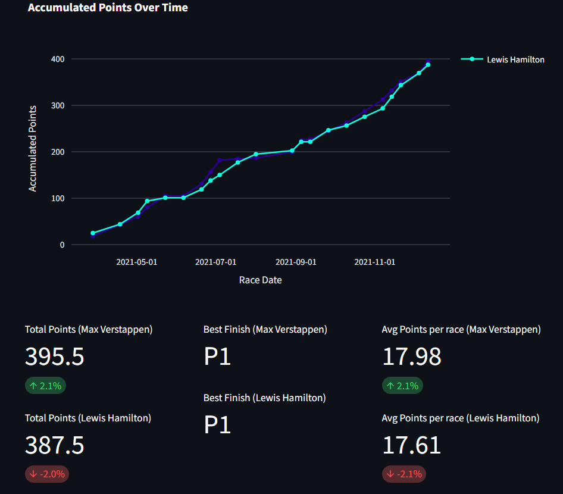
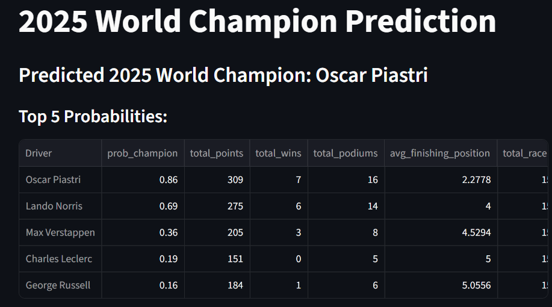

# Notes
- Pit stop times from the data contains the time for the entire pit sequence from pitlane entry to pitlane exit, not just the time to change tyres and release the car.

# Initial Setup
```
pip install requirements.txt
```

# Running instructions
```
cd /pages
streamlit run app.py
```
# Data Source
- https://www.kaggle.com/datasets/rohanrao/formula-1-world-championship-1950-2020/data (2018-2024)

- https://github.com/toUpperCase78/formula1-datasets (2025 data)

# Overview

## Select and view driver or team statistics for any time from 2018-2024 (inclusive)


## Compare teams or drivers


## Predict the 2025 Drivers World Champion
- This model uses Random Forest Classification
- It previously predicted Lando Norris to be the 2025 world champion with data up to the Hunagarian GP, this changed after his engine failure in the following race
- Note: This contains data up to 2025 round 15 (Dutch GP)
